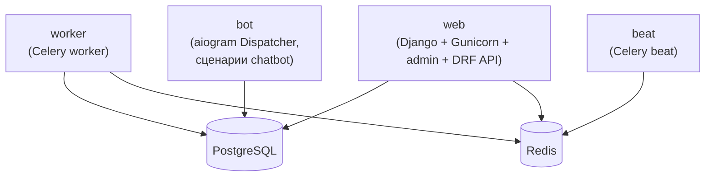

# Архитектура

## Почему один проект, а не четыре сервиса

Все четыре направления (новости, база знаний, консультации, чат-бот) — часть одной экосистемы
skidiscoverer, а не независимые продукты. Дробить их на отдельные сервисы означало бы четыре
деплоя, четыре БД, четыре набора секретов ради задач, которые технически почти всегда сводятся
к «Django-модель + admin + иногда Celery-таска». Поэтому это **один Django-проект**, а
направления — отдельные Django-apps со своими моделями и своим срезом admin/API:

| App | Отвечает за |
|---|---|
| `news` | парсинг источников, дедуп, модерация, публикация новостей |
| `knowledge_base` | материалы по технике катания (видео + документы) для ЛК |
| `consultations` | заявки на консультацию (с Тильда-формы и из Telegram-бота) |
| `chatbot` | сценарии Telegram-бота для участников клуба |

Apps не лезут друг в друга напрямую. В частности, `chatbot` и `consultations` — сознательно
**не связаны**: это разные формы для разных целей и разных процессов обработки. `chatbot` —
чисто информационный (меню, ссылки, включая ссылку на форму консультации), никаких заявок сам
не создаёт и не пишет в модель `ConsultationRequest`; `consultations` работает только с формой
на Тильде (см. `docs/CHATBOT.md` и `docs/CONSULTATIONS.md`). Если один из модулей вырастет
настолько, что ему понадобится отдельная инфраструктура (например, `chatbot` превратится в
ИИ-бота с векторным поиском) — его можно будет вынести в отдельный сервис позже, не переписывая
остальное: контракт с ЛК и остальными apps уже описан через REST API, а не через прямые импорты
кода.

## Компоненты

1. **Django-приложение** (`news`, `knowledge_base`, `consultations`, `chatbot`, `api`) —
   модели данных, Django admin (для `Source`/CRM заявок — модерация новостей теперь НЕ через
   admin, см. п.9 ниже), REST API для ЛК.
2. **Celery worker** — задачи парсинга источников, вызова LLM-редактора, рассылки писем
   модерации, публикации новостей, отправки уведомлений.
3. **Celery beat** (через `django-celery-beat`) — расписание запуска парсеров, редактируется
   прямо в Django admin (не в коде) — см. `docs/TECH_STACK.md` за обоснованием выбора. Сюда же
   заведены и остальные периодические задачи ветки `news`: сборка+обработка батча редактором
   (06:00/18:00 UTC), публикация из очереди (те же два времени), еженедельная re-модерация
   (понедельник 06:00 UTC) — см. п.9.
4. **PostgreSQL** — основное хранилище (источники, новости, материалы базы знаний, заявки,
   лог публикаций/уведомлений).
5. **Redis** — брокер задач для Celery.
6. **Telegram Bot API — два разных использования одного бота**:
   - разовые вызовы (`sendMessage`/`sendPhoto` — `sendPhoto`, если у новости есть `image_url`,
     иначе `sendMessage`, картинка необязательна) из Celery-таски — публикация новостей в канал,
     уведомления менеджеру о новой заявке;
   - постоянно работающий процесс `bot` (aiogram Dispatcher, long polling) — интерактивные
     сценарии `chatbot` для участников. Конфликта нет: `getUpdates` (приём сообщений) делает
     только процесс `bot`, а Celery дёргает только методы отправки — см. `docs/CHATBOT.md`.
7. **Внешний видеохостинг** (см. `docs/TECH_STACK.md`, «Видеохостинг») — сами видео мы не
   храним, `knowledge_base` хранит только ссылку/ID материала на площадке.
8. **REST API для ЛК** — Django REST Framework: отдаёт опубликованные новости и материалы базы
   знаний (pull); принимает заявки на консультацию (см. `docs/CONSULTATIONS.md`); опционально —
   исходящий вебхук при публикации новости (см. `docs/INTEGRATION_LK.md`). Отдельно есть идея
   (не решение, см. `docs/CODER_INSTRUCTIONS.md`) публиковать в ЛК зеркалированием уже
   опубликованного из Telegram-канала вместо/вместе с pull API — не реализовывать без отдельного
   запроса.
9. **LLM-редактор (GigaChat) + email-модерация** — прослойка между парсингом и публикацией,
   специфичная для `news`, подробно расписана в `docs/DATA_MODEL.md` (раздел «Модерация по
   email и очередь публикации») и в `parser/EDITOR_PROMPT.md`:
   - **LLM-редактор** (GigaChat, тариф для физлица, уровень Pro — выбор обоснован в
     `docs/TECH_STACK.md`) получает батч `NewsItem`, отбирает и переписывает подходящие в
     готовые посты (`edited_title`/`edited_post_text`), остальное отбрасывает.
   - **Email-модерация**: каждая одобренная редактором новость уходит отдельным письмом на
     `info@skidiscoverer.ru` с тремя ссылками-действиями (Опубликовать / Опубликовать срочно /
     Отклонить) — подписанные `django.core.signing`-токены, без отдельной таблицы и без логина.
   - **Очередь публикации** — вычисляемая выборка `Article(status='approved')`, БЕЗ верхнего
     лимита, срочные первыми, публикуется по 2 записи на каждый из двух batch-таймов (4/день).
   - **Еженедельная re-модерация** (по понедельникам 06:00 UTC) — дайджест зависших в очереди
     новостей возвращается модератору повторно, чтобы не публиковать устаревшее без проверки.

## Поток данных

```mermaid
flowchart LR
    subgraph Sources["Источники новостей"]
        RSS["RSS-фиды"]
        HTML["HTML-страницы\n(кастомный парсинг)"]
    end

    Beat["Celery beat\n06:00 / 18:00 UTC"] --> Worker

    subgraph Worker["Celery worker: парсинг"]
        Fetch["Получить записи\n(feedparser / trafilatura)\nкартинка необязательна"] --> Norm["Нормализация\n(title, url, text, date)"]
        Norm --> Dedup["Дедупликация\n(URL-хэш + rapidfuzz по заголовку)"]
    end

    RSS --> Fetch
    HTML --> Fetch

    Dedup -->|дубликат| Discard["status = duplicate\n(в БД остаётся, не в очереди)"]
    Dedup -->|новая новость| Editor

    subgraph Editor["LLM-редактор (GigaChat)"]
        direction TB
        Eval["Оценка по промту\n(EDITOR_PROMPT.md)"]
    end

    Editor -->|editor_verdict=reject| EditorReject["отброшено редактором"]
    Editor -->|editor_verdict=publish| Pending[(status=pending_moderation\nedited_title/edited_post_text)]

    Pending --> Mail["Email модератору\ninfo@skidiscoverer.ru\n3 ссылки: публикация/срочно/отклонить"]
    Mail -->|Опубликовать / срочно| Approved[(status=approved\nis_urgent?)]
    Mail -->|Отклонить| Rejected["status = rejected"]

    Approved --> Queue["Очередь публикации\n(без лимита, срочные первыми,\nдалее по source_published_at)"]
    Queue -->|раз в неделю, пн 06:00 UTC| Requeue["Дайджест re-модерации\n(зависшие approved → снова на почту)"]
    Requeue --> Mail

    Queue -->|2 записи за прогон, 4/день| Publish["Celery-таска: публикация"]

    Publish --> TG["Telegram Bot API\n(канал клуба)\nsendPhoto/sendMessage"]
    Publish --> API["REST API /api/v1/news/\n(ЛК читает / получает вебхук)"]

    TG --> Log[("PublicationLog\n(аудит, статус, ретраи)")]
    API --> Log
```



## Жизненный цикл новости (статусы `Article.status`)

```
new → (dedup check) → duplicate | (LLM-редактор)
(LLM-редактор, editor_verdict) → reject (дальше не идёт) | publish → pending_moderation
pending_moderation → (email-ссылка модератора) → approved | rejected
approved → (Celery-таска публикации, из очереди) → published
approved → (без действия дольше недели) → снова письмо модератору (пн 06:00 UTC, дайджест),
    статус не меняется, пока модератор не кликнет
```

Полный процесс модерации/публикации (email-ссылки, механизм токенов, очередь без лимита,
re-модерация) — подробно в `docs/DATA_MODEL.md`, раздел «Модерация по email и очередь
публикации». Подробности полей — там же.

## Почему парсер — отдельный сервис, а не часть ЛК

ЛК участника клуба разрабатывается отдельно, стек не зафиксирован. Если встроить парсер
внутрь ЛК, оба проекта окажутся жёстко связаны по срокам и технологиям. Вместо этого парсер:

- работает независимо, публикует новости через REST API (pull) и, опционально, через вебхук
  (push) — см. `docs/INTEGRATION_LK.md`;
- не знает и не должен знать, как устроен ЛК изнутри — только контракт API;
- можно разрабатывать и деплоить параллельно с ЛК, а интеграцию подключить, когда стек ЛК
  определится.

## Возможное развитие (не входит в MVP, но архитектура это не блокирует)

- Интерактивный Telegram-бот для модераторов (одобрение/отклонение прямо из чата, вместо
  email-ссылок) — потребует перехода с разового вызова Bot API на полноценный бот-процесс
  (aiogram Dispatcher). Модели уже поддерживают это (см. `moderated_by`, `status` в
  `DATA_MODEL.md`) — можно добавить как альтернативный канал модерации, не переделывая схему.
- Сегментация новостей по тарифам подписки — потребует добавления поля `visibility`/`tier`
  в `Article` и логики на стороне ЛК.
- Несколько Telegram-каналов или других каналов публикации — модель `PublishChannel`
  уже это закладывает.

## Инфраструктурная схема (сервисы docker-compose)



`bot` — отдельный процесс/контейнер, не Celery-таска: ему нужно постоянно слушать входящие
сообщения (`getUpdates`), а не выполняться разово. Подробности — `docs/CHATBOT.md`.
